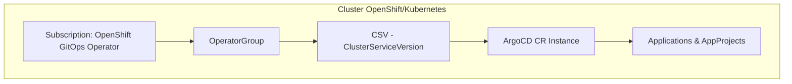

# argocd-gitops

Repositório GitOps para instalação e configuração do **Argo CD** em ambientes **OpenShift/Kubernetes** utilizando o **OpenShift GitOps Operator**.  
Este repositório implementa práticas de **Infrastructure as Code (IaC)**, garantindo versionamento, rastreabilidade e consistência em múltiplos ambientes (dev, uat, prd).

---

## 📌 Objetivo

- Instalar o **OpenShift GitOps (Argo CD Operator)** via OLM (Operator Lifecycle Manager).  
- Criar e gerenciar instâncias do **Argo CD** (`ArgoCD CR`).  
- Padronizar o fluxo de deploy entre ambientes.  
- Preparar a base para que workloads (ex.: Keycloak, Postgres) sejam gerenciados posteriormente pelo Argo CD.  

---

## 🏗️ Arquitetura



---

## 📂 Estrutura do Repositório

```
argocd-gitops/
├── README.md                # Documentação principal
├── base/                    # Manifests genéricos do Argo CD
│   ├── kustomization.yaml
│   ├── namespace.yaml       # Criação do namespace openshift-gitops
│   ├── operatorgroup.yaml   # OperatorGroup do Argo CD
│   └── subscription.yaml    # Subscription do OpenShift GitOps Operator
└── overlays/                # Overlays por ambiente
    ├── dev/
    │   └── kustomization.yaml
    ├── uat/
    │   └── kustomization.yaml
    └── prd/
        └── kustomization.yaml
```

---

## 🚀 Como utilizar

1. Clonar o repositório

```
git clone git@github.com:thiagobotelho/argocd-gitops.git
cd argocd-gitops
```

2. Aplicar no cluster

Sem Argo CD ainda, use kubectl/oc diretamente:

```
oc apply -k overlays/dev
oc apply -k overlays/uat
oc apply -k overlays/prd
```

3. Validar instalação

```
oc get csv -n openshift-gitops
oc get pods -n openshift-gitops
oc get route -n openshift-gitops openshift-gitops-server
```

Acesse o Argo CD via Route.

Autenticação padrão: integra-se ao OAuth do OpenShift (usuários com cluster-admin entram como admin).

## 🔄 Fluxo de Deploy com Waves

Ordem de aplicação dos manifests (via annotations argocd.argoproj.io/sync-wave):

Wave 0 → Namespace, OperatorGroup, Subscription.
Wave 1 → ArgoCD CR (instância do Argo CD).

## ✅ Boas práticas corporativas

Namespace dedicado: openshift-gitops.
Subscription Approval:
Automatic em dev/uat.
Manual em prd (alinhado ao processo de Change Management).
IgnoreDifferences: evitar drift em Subscription/CSV gerados pelo OLM.
RBAC: utilizar AppProjects no Argo CD para isolar times/aplicações.
Segurança: expor Argo CD apenas via Route TLS, nunca via NodePort.

# 📚 Referências

OpenShift GitOps Documentation
Argo CD Official
Kustomize Docs
