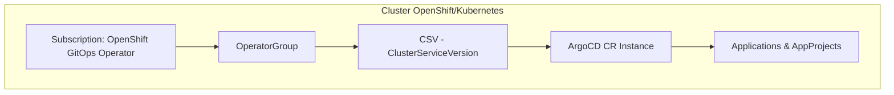

# argocd-gitops

Repositório GitOps para instalação e configuração do **Argo CD** em ambientes **OpenShift/Kubernetes** utilizando o **OpenShift GitOps Operator**.  
Este repositório implementa práticas de **Infrastructure as Code (IaC)**, garantindo versionamento, rastreabilidade e consistência em múltiplos ambientes (dev, uat, prd).

---

## 📌 Objetivo

- Provisionar o **OpenShift GitOps (Argo CD Operator)** via OLM (Operator Lifecycle Manager).  
- Criar e gerenciar instâncias do **Argo CD** (`ArgoCD CR`).  
- Padronizar o fluxo de deploy entre ambientes.  
- Estabelecer a base para workloads futuros (ex.: Keycloak, Postgres).  

---

## 🏗️ Arquitetura



---

## 📂 Estrutura do Repositório

```bash
argocd-gitops/
├── README.md                # Documentação principal
├── base/                    # Manifests genéricos do Argo CD
│   ├── kustomization.yaml
│   ├── namespace.yaml       # Criação do namespace openshift-gitops
│   ├── operatorgroup.yaml   # OperatorGroup do Argo CD
│   └── subscription.yaml    # Subscription do OpenShift GitOps Operator
└── overlays/                # Overlays por ambiente
    ├── dev/
    │   └── kustomization.yaml
    ├── uat/
    │   └── kustomization.yaml
    └── prd/
        └── kustomization.yaml
```

---

## 🚀 Como utilizar

### 1. Clonar o repositório
```bash
git clone git@github.com:thiagobotelho/argocd-gitops.git
cd argocd-gitops
```

### 2. Aplicar no cluster
Se o Argo CD ainda não estiver provisionado, aplique os manifests com `oc`/`kubectl`:

```bash
oc apply -k overlays/dev
oc apply -k overlays/uat
oc apply -k overlays/prd
```

### 3. Validar instalação
```bash
oc get csv -n openshift-gitops
oc get pods -n openshift-gitops
oc get route -n openshift-gitops openshift-gitops-server
```

- **Acesso à UI**: via Route exposta.  
- **Autenticação**: integrada ao OAuth do OpenShift. Usuários com `cluster-admin` têm acesso administrativo inicial.  

---

## 🔄 Fluxo de Deploy (Sync Waves)

A ordem de aplicação dos manifests pode ser controlada com `argocd.argoproj.io/sync-wave`:

- **Wave 0** → `Namespace`, `OperatorGroup`, `Subscription`.  
- **Wave 1** → `ArgoCD CR` (instância do Argo CD).  

---

## ✅ Boas práticas corporativas

- **Namespace dedicado**: `openshift-gitops`.  
- **Subscription Approval**:  
  - `Automatic` em **dev/uat**.  
  - `Manual` em **prd** (alinhado a Change Management).  
- **IgnoreDifferences**: evitar drift em `Subscription` e `CSV` gerados pelo OLM.  
- **RBAC**: utilizar `AppProjects` no Argo CD para isolar times e aplicações.  
- **Segurança**: expor o Argo CD apenas via Route TLS (não usar NodePort).  

---

## 🔮 Próximos passos

- [ ] Criar um `ArgoCD CR` customizado (HA, RBAC, Redis, Sharding).  
- [ ] Implementar **App of Apps** para bootstrap de workloads.  
- [ ] Integrar com **SealedSecrets** ou **External Secrets Operator** para gestão segura de segredos.  
- [ ] Configurar monitoramento do Argo CD com **Prometheus/Grafana**.  

---

## 📚 Referências

- [OpenShift GitOps Documentation](https://docs.openshift.com/container-platform/latest/cicd/gitops/understanding-openshift-gitops.html)  
- [Argo CD Official](https://argo-cd.readthedocs.io/en/stable/)  
- [Kustomize Docs](https://kubectl.docs.kubernetes.io/guides/introduction/kustomize/)  

---

👨‍💻 **Maintainer:** [Thiago Botelho](https://github.com/thiagobotelho)
