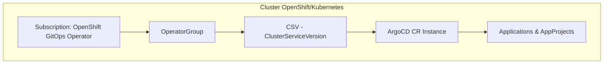

# argocd-gitops

Repositório GitOps para instalação e configuração do **Argo CD** em ambientes **OpenShift/Kubernetes** utilizando o **OpenShift GitOps Operator**.  
Este repositório implementa práticas de **Infrastructure as Code (IaC)**, garantindo versionamento, rastreabilidade.

---

## 📌 Objetivo

- Provisionar o **OpenShift GitOps (Argo CD Operator)** via OLM (Operator Lifecycle Manager).  
- Criar e gerenciar instâncias do **Argo CD** (`ArgoCD CR`).  
- Padronizar o fluxo de deploy entre ambientes.  
- Estabelecer a base para workloads da stack local de observabilidade.

---

## Arquitetura


```mermaid
flowchart TD
    A[Subscription: OpenShift GitOps Operator] --> B[OperatorGroup]
    B --> C[CSV - ClusterServiceVersion]
    C --> D[ArgoCD CR Instance]
    D --> E[Applications & AppProjects]

    subgraph cluster [Cluster OpenShift/Kubernetes]
        A
        B
        C
        D
        E
    end
```

---

## 📂 Estrutura do Repositório

```bash
argocd-gitops/
├── README.md                  # Documentação principal
├── base/                      # Manifests genéricos
│   ├── kustomization.yaml     # Orquestra recursos com waves
│   ├── namespace.yaml         # Namespace openshift-gitops
│   ├── operatorgroup.yaml     # OperatorGroup
│   ├── subscription.yaml      # Subscription do Operator
├── overlays/cluster/          # Bootstrap do OpenShift GitOps
├── overlays/desenvolvimento/  # App-of-apps para CRC/local
├── overlays/aceite/           # App-of-apps para homologação
├── overlays/producao/         # App-of-apps para produção
├── overlays/applications/     # Applications renderizadas por ambiente
└── optional/                  # Applications opcionais, ex.: Network Observability

```

---

## 🚀 Como utilizar

O App-of-Apps em `overlays/desenvolvimento` gerencia MetalLB, Prometheus Apps,
Loki, Tempo, OpenTelemetry, Keycloak, Grafana e Zabbix no CRC. As aplicações
apontam para os overlays equivalentes em cada repositório e todas usam sync
automático com `prune` e `selfHeal`. Crie primeiro os Secrets documentados em
cada repositório; credenciais não são mantidas neste projeto.

Tutorial completo da stack local: [docs/TUTORIAL-CRC-STACK.md](docs/TUTORIAL-CRC-STACK.md).

### 1. Clonar o repositório
```bash
git clone https://github.com/<org-ou-usuario>/argocd-gitops.git
cd argocd-gitops
```

### 2. Aplicar no cluster
Se o Argo CD ainda não estiver provisionado, aplique os manifests com `oc`/`kubectl`:

```bash
oc apply -k overlays/cluster
oc wait --for=condition=Available deployment/openshift-gitops-server \
  -n openshift-gitops --timeout=10m
oc apply -k overlays/desenvolvimento
```

### 3. Validar instalação
```bash
oc get csv -n openshift-gitops
oc get pods -n openshift-gitops
oc get route -n openshift-gitops openshift-gitops-server
```

- **Acesso à UI**: via Route exposta.  
- **Autenticação**: integrada ao OAuth do OpenShift. Usuários com `cluster-admin` têm acesso administrativo inicial.  

---

## 🔄 Fluxo de Deploy (Sync Waves)

A ordem de aplicação dos manifests pode ser controlada com `argocd.argoproj.io/sync-wave`:

- **Wave 0** → `Namespace`, `OperatorGroup`, `Subscription`.  
- **Wave 1** → `ArgoCD CR` (instância do Argo CD).  

---

## ✅ Boas práticas corporativas

- **Namespace dedicado**: `openshift-gitops`.  
- **Subscription Approval**: `Automatic`.  
- **IgnoreDifferences**: evitar drift em `Subscription` e `CSV` gerados pelo OLM.  
- **RBAC**: utilizar `AppProjects` no Argo CD para isolar times e aplicações.  
- **Segurança**: expor o Argo CD apenas via Route TLS (não usar NodePort).  

> O `ClusterRoleBinding` concede `cluster-admin` ao application controller para
> o cenário de bootstrap do cluster. Em ambientes compartilhados, substitua-o
> por papéis mínimos compatíveis com os namespaces e recursos gerenciados.

---

## 🔮 Próximos passos

- [ ] Criar um `ArgoCD CR` customizado (HA, RBAC, Redis, Sharding).  
- [x] Implementar **App of Apps** para bootstrap de workloads.
- [ ] Integrar com **SealedSecrets** ou **External Secrets Operator** para gestão segura de segredos.  
- [x] Configurar monitoramento básico do Argo CD com **Prometheus/Grafana**.

---

## 📚 Referências

- [OpenShift GitOps Documentation](https://docs.openshift.com/container-platform/latest/cicd/gitops/understanding-openshift-gitops.html)  
- [Argo CD Official](https://argo-cd.readthedocs.io/en/stable/)  
- [Kustomize Docs](https://kubectl.docs.kubernetes.io/guides/introduction/kustomize/)  

## Ambientes e validação

```bash
oc kustomize overlays/desenvolvimento >/tmp/argocd-dev.yaml
oc kustomize overlays/aceite >/tmp/argocd-aceite.yaml
oc kustomize overlays/producao >/tmp/argocd-prod.yaml
oc kustomize overlays/applications/desenvolvimento >/tmp/apps-dev.yaml
oc apply --dry-run=client -k overlays/desenvolvimento
```

O app-of-apps de `desenvolvimento` aponta para `overlays/desenvolvimento` dos
repos gerenciados. `aceite` e `producao` apontam para os overlays equivalentes.
Veja `docs/AMBIENTES.md`.
